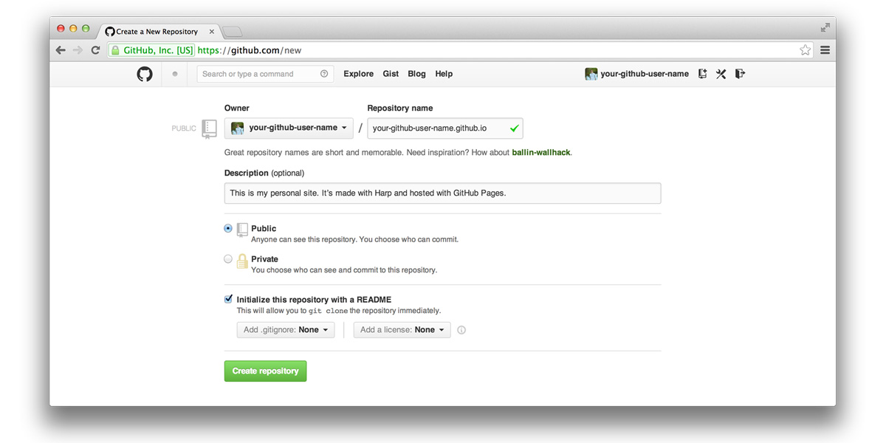

===

标题: 快速搭建你的 github page 个人博客 —— 基于 Create-React-App 的单页面应用实践
标签: 前端, nodejs, react

===

相信各位github资深玩家们都有自己基于 `github page` 搭建的个人站点。官方推荐的静态站点生成器是 `Jekyll`，关于 `Jekyll` 的使用感兴趣的各位请自行 google，这里就不赘述了。本文主要介绍下基于 `Create-React-App` 搭建个人博客的相关实践，可能更适合做前端开发的伙伴。



`github page` 是 `github` 推出的静态站点服务，主要的用途在于使用你在 `github` 仓库中的代码构建你自己的静态站点，为用户提供 `github.io` 二级域名，您也可以通过添加DNS的 `CNAME` 记录来绑定自己的域名。

`github page` 最简单粗暴的方法就是直接往 github 上方静态页面了，创建一个名为 `[您的github账号名].github.io` 的github仓库，将您的index.html页面代码扔进master分支，就可以直接通过 `https://[您的github账号名].github.io` 访问到您的站点了。

对于一个简单的个人博客站点来说，存在以下基本功能特性：

* 文章的新增、编辑、一键发布
* 文章的分类、归档yarn
* 风格良好的博客样式
* 评论、SEO等功能

下面介绍基于React如何实现一个简单的静态博客。

## 1. 创建一个 React 项目

使用 Create-React-App（以下简称CRA） 的generator创建一个React前端项目骨架。对此项目进行一定改造以方便我们日常的开发和使用习惯：

* 使用`react-app-rewired`来调整CRA中webpack的配置
  * 对CRA的webpack配置感兴趣的童鞋可以看看[这篇文章](https://zhaozhiming.github.io/blog/2018/01/08/create-react-app-override-webpack-config/)
* 使用`core-js`对浏览器版本进行向下兼容
* 通过编写不同的React容器组件（container）来实现不同的页面，通过统一的json结构来配置应用的页面路由
* 使用蚂蚁金服的`antd`设计语言（React组件）快速实现业务UI
* 使用`axios`实现前后端的数据请求

个人改造后的项目代码在[这里](https://github.com/parksben/react-spa-app)，您可以直接fork或者down下来使用。

## 2. 使用 markdown 搞定你的文章
### 2.1 用于新建文章的交互式命令行（基于 inquirer）

一般的静态博客系统（如gatsby），会给用户提供一个用于创建新文章的交互式命令行，效果大致如下：


类似功能可以使用nodejs中[readline模块](https://nodejs.org/dist/latest-v8.x/docs/api/readline.html)的原生方法来实现。这里推荐一个第三方工具：[inquirer](https://github.com/SBoudrias/Inquirer.js)，本质上是对readline模块进行了增强，提供了很多实用的方法用于交互式命令行开发，实现的用户界面（命令行）也比较友好。

对于上面GIF示例的功能，其代码实现如下：

```js
// newPost.js

const inquirer = require('inquirer');
const moment = require('moment');

const questions = [
  {
    type: 'input',
    name: 'post_name',
    message: '请输入您的文章别名（用于创建文章目录，仅限英文，单词间用短横杠‘-’连接）：',
    validate: value => {
      if (/(\.|\*|\?|\\|\/)/gi.test(value)) {
        return '文章别名不得包含特殊符号（.*?\\/），请重新输入↑↑';
      }

      if (/(([A-z]+-)+)?[A-z]+/gi.test(value)) {
        return true;
      }

      return '文章别名不合法，请重新输入↑↑';
    },
    filter: value => value.replace(/\s+/gi, '-'),
  },
  {
    type: 'input',
    name: 'create_at',
    message: '请输入文章的发布时间（或者按回车键使用默认值）：',
    default: () => {
      return moment().format('YYYY-MM-DDThh:mm:ss');
    },
    validate: value => {
      if (/\d{4}-\d\d-\d\dT\d\d:\d\d:\d\d/gi.test(value)) {
        return true;
      }

      return '时间格式不合法，请重新输入↑↑';
    },
  },
];

inquirer
  .prompt(questions)
  .then(answers => {
    // 获取用户输入
    const { post_name, create_at } = answers;
  
    /* 此处做一些命令行反馈和过程性的工作 */
    /* （如：提示用户输入是否合法、创建文章对应的目录和文件等等） */
  })
  .catch(err => {
    /* 异常处理 */
  });
```

如是，将此node脚本添加到项目`package.json`的`scripts`中（如：`new-post: "node newPost.js"`），即可通过`yarn new-post`命令运行。

### 2.2 md 转 html（基于 react-markdown）

为使用markdown文档来编辑、存储博客的文章内容，需要将md文档内容转换为react的JSX对象以渲染到网页中。在此推荐使用[react-markdown](https://github.com/rexxars/react-markdown)，功能很6，作者维护得也比较勤。

使用方式如下：

```js
import ReactMarkdown from 'react-markdown';

<ReactMarkdown source={'# 这是文章标题\n\n'} />
// <h1>这是文章标题</h1>
```

### 2.3 代码块的语法高亮

react-markdown提供了一个renderers属性，用户可以传入一系列renderer组件来自定义文章中一些内容的渲染方式（有兴趣的童鞋可以看下包作者对[默认renderer的实现](https://github.com/rexxars/react-markdown/blob/master/src/renderers.js)）。

如：自定义md中图片的渲染方式（用法如下）。

```js
// 传入renderer的方式
<ReactMarkdown
  source={'[md文本内容]'}
  renderers={{
    image: ImageRenderer,
  }}
/>
```

```js
// ImageRenderer的实现

import React, { Component } from 'react';
import PropTypes from 'prop-types';

class ImageRenderer extends Component {
  static propTypes = {
    src: PropTypes.string.isRequired,
  };

  render() {
    return (
      
    );
  }
}

export default ImageRenderer;
```

与此类似，我们可以通过传入一个自定义的renderer来实现文章中代码块的语法高亮。名为`CodeBlock`的renderer实现如下：

```js
import React, { Component } from 'react';
import PropTypes from 'prop-types';
import { highlight, languages } from 'prismjs';
import ReactHtmlParser from 'react-html-parser';
import 'prismjs/themes/prism.css';

export class HtmlComponent extends Component {
  static propTypes = {
    html: PropTypes.string.isRequired,
  };

  render() {
    return ReactHtmlParser(this.props.html);
  }
}

export class CodeBlock extends Component {
  static propTypes = {
    literal: PropTypes.string.isRequired,
    language: PropTypes.string.isRequired,
  };

  render() {
    const html = highlight(this.props.literal, languages[this.props.language]);
    const cls = `language-${this.props.language}`;

    return (
      <pre className={cls}>
        <code className={cls}>
          <HtmlComponent html={html} />
        </code>
      </pre>
    );
  }
}

export default CodeBlock;
```

此处用到了[prismjs](http://prismjs.com/)和[react-html-parser](https://github.com/wrakky/react-html-parser)两个npm包，前者用于将代码文本转化为html文本，后者用于将html文本转化为React的JSX对象以传入React组件（这样做比直接使用[dangerouslySetInnerHTML](https://reactjs.org/docs/dom-elements.html#dangerouslysetinnerhtml)属性更安全些）。

## 3. 文章分类

一个友好的站点肯定少不了导航菜单（或文章的分类菜单），本人的实现方式是直接使用文章的“标签”来进行分类统计，并生成站点的顶部导航，效果如下：


为此，需要撰写一定的脚本实现文章的分类统计和打包，个人的实现方式是将统计结果和文章内容各自打包为json文件，通过前端组件请求数据并加载。

导航栏组件的具体实现如下：

```js
import React, { Component } from 'react';
import PropTypes from 'prop-types';
import { Link } from 'react-router-dom';
import { Dropdown, Menu, Icon } from 'antd';
import { randomId } from 'utils';
import './style.css';

export class Header extends Component {
  static propTypes = {
    data: PropTypes.array,
    activeTag: PropTypes.string,
  };

  static defaultProps = {
    data: [{ tag: '前端', count: 5 }],
    activeTag: '',
  };

  constructor(props) {
    super(props);
    this.navTotal = 6;
  }

  renderMore() {
    if (this.props.data.length <= this.navTotal) {
      return false;
    }

    const subNavItems = this.props.data.slice(this.navTotal).map(t =>
      <Menu.Item key={`sub_nav_${randomId()}`}>
        <Link
          to={t.linkTo || `/tag/${t.tag}`}
          className={`ant-dropdown-link ${this.props.activeTag === t.tag
            ? 'active'
            : ''}`}
          key={`nav_top_${randomId()}`}>
          {t.tag}（{t.count}）
        </Link>
      </Menu.Item>
    );

    const SubNav = (
      <Menu>
        {subNavItems}
      </Menu>
    );

    const DropDownBtn = (
      <Dropdown overlay={SubNav} key={`nav_top_${randomId()}`}>
        <div className="header-nav-item">
          更多分类 <Icon type="down" />
        </div>
      </Dropdown>
    );

    return DropDownBtn;
  }

  renderTop5() {
    const items = this.props.data.slice(0, this.navTotal - 1).map(t =>
      <Link
        className={`header-nav-item ${this.props.activeTag === t.tag
          ? 'active'
          : ''}`}
        to={t.linkTo || `/tag/${t.tag}`}
        key={`nav_top_${randomId()}`}>
        {!t.linkTo ? `${t.tag}（${t.count}）` : t.tag}
      </Link>
    );

    return (
      <div className="header-nav">
        {items}
        {this.renderMore()}
      </div>
    );
  }

  render = () => this.renderTop5();
}

export default Header;
```

大家可以根据实际需要实现自己的文章打包方式（这里就不奉上我的脚本了😝）。

## 4. 更多功能

对于个人博客来说，到这里为止还有很多功能没有实现，这里偷个懒，奉上一些相关的链接吧：

### 4.1 关于文章评论

* [在GitHub Pages中加入Disqus评论系统](http://www.forestofhorizon.com/notesofstudy/2015/12/01/adding-disqus-to-github-pages/)
* [使用 GitHub Issues 搭建评论系统](https://imsun.net/posts/gitment-introduction/)

### 4.2 关于文章结构树

* [TreeMDown](https://github.com/hollodotme/TreeMDown)
* [markdown-tree](https://github.com/hughsk/markdown-tree)

我最近应该会实现一个React用途的markdown树组件，大家不妨期待下☺️

## 5. 发布你的个人静态站点
### 5.1 部署到 github page（基于 gh-pages）

CRA针对github page用途专门推荐了一个包：[gh-pages](https://github.com/tschaub/gh-pages)，使用方法如下：

（1）修改项目的`package.json`文件，添加homepage属性：

```
"homepage": "https://parksben.github.io",
```

（2）项目安装`gh-pages`依赖后，在`package.json`中添加如下配置：

```
  "scripts": {
+   "predeploy": "npm run build",
+   "deploy": "gh-pages -d build",
    "start": "react-scripts start",
    "build": "react-scripts build",
```

（3）将本地代码上传到github博客仓库的某个分支（只要不是master分支就行），然后执行：

```
yarn deploy
```

gh-pages会将CRA项目build到仓库的master分支，然后，你就可以访问你的站点了（有关 CRA 项目部署到 github page 的详细描述可以看[这里](https://github.com/facebook/create-react-app/blob/master/packages/react-scripts/template/README.md#github-pages)）。

### 5.2 如何兼容 React 的客户端路由（一种比较 hack 的方法）

单页面应用一般需要设置服务端路由，将应用的所有页面路径都重定向到index.html，而github page并没有这样的默认设置。

因而，当你使用React的客户端路由（React的createBrowserHistory方法创建前端路由）时，除根路径以外的页面，github都会返回自己的404页面。

为此，CRA项目提供了一种比较hack的方法来支持React的客户端路由（通过操作window.history来强行匹配url）。也算是一种奇技淫巧吧☺️。

（1）在CRA项目的public目录下添加一个`404.html`，其内容如下：

```html
<!DOCTYPE html>
<html>
  <head>
    <meta charset="utf-8">
    <title>矮大紧的日常 | parksben's blog</title>
    <script type="text/javascript">
      var segmentCount = 0;
      var l = window.location;
      l.replace(
        l.protocol + '//' + l.hostname + (l.port ? ':' + l.port : '') +
        l.pathname.split('/').slice(0, 1 + segmentCount).join('/') + '/?p=/' +
        l.pathname.slice(1).split('/').slice(segmentCount).join('/').replace(/&/g, '~and~') +
        (l.search ? '&q=' + l.search.slice(1).replace(/&/g, '~and~') : '') +
        l.hash
      );
    </script>
  </head>
  <body>
  </body>
</html>
```

（2）在`index.html`的head中添加如下代码：

```html
<script type="text/javascript">
  (function(l) {
    if (l.search) {
      var q = {};
      l.search.slice(1).split('&').forEach(function(v) {
        var a = v.split('=');
        q[a[0]] = a.slice(1).join('=').replace(/~and~/g, '&');
      });
      if (q.p !== undefined) {
        window.history.replaceState(null, null,
          l.pathname.slice(0, -1) + (q.p || '') +
          (q.q ? ('?' + q.q) : '') +
          l.hash
        );
      }
    }
  }(window.location))
</script>
```

大功告成，你的github站点支持React的客户端路由了。

除此之外，也可以改为使用`createHashHistory`方法来创建客户端路由，这样前端路由就与服务端路由没多大关系了，不过url里面一串hash毕竟不够优雅。

有兴趣了解奇技淫巧的童鞋，可以点[这里](https://github.com/facebook/create-react-app/blob/master/packages/react-scripts/template/README.md#notes-on-client-side-routing)。

### 5.3 部署到自己的服务

与CRA项目的生产环境部署方式一样：

* 线上执行 yarn build 命令，站点的所有静态资源将打包到 build 目录下
* 将你的站点入口配置到 build 目录下

## 6. 项目参考（源码奉上）


这是[我的github博客](https://parksben.github.io/)（基于上述过程实现的静态站点），感兴趣的伙伴可以[点击这里](https://github.com/parksben/parksben.github.io)查看项目源码，觉得有用也可以fork或star一下下。